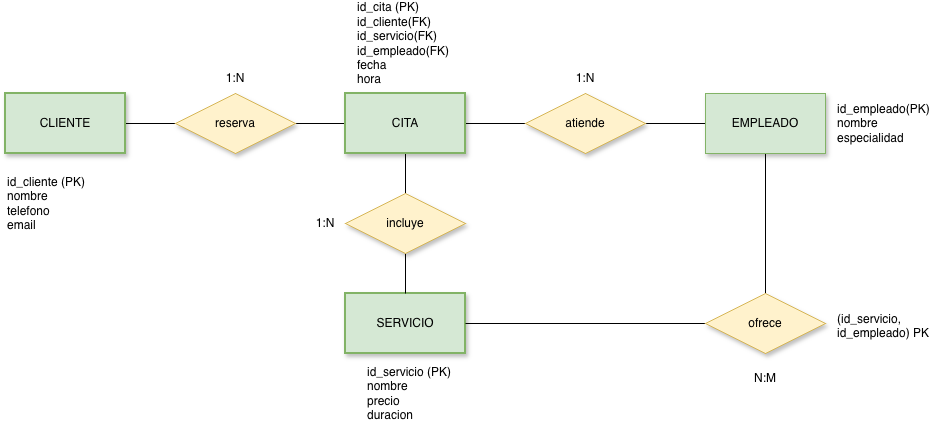
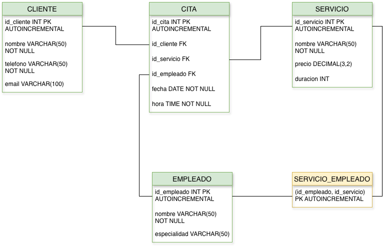

# Belladonna Estética

Proyecto Intermodular de 1º de DAW — Prometeo by The Power (2025/2026)

## Descripción

Belladonna Estética es un centro de estética ficticio ubicado en Puerto de Pollensa (Mallorca), especializado en manicura y pedicura semipermanente, depilación de cejas con hilo y cera, y lifting de pestañas.

Este proyecto simula el desarrollo integral de un portal web corporativo y su sistema de gestión interno, abarcando desde el diseño de la base de datos hasta la maquetación web y la programación de una aplicación de gestión.

## Tecnologías utilizadas

- **HTML5 + CSS3** — Maquetación y diseño del portal web
- **MySQL** — Base de datos relacional
- **Java + JDBC** — Aplicación de gestión (CRUD) conectada a la base de datos
- **Git + GitHub** — Control de versiones

## Estructura del repositorio

```
belladonna-estetica/
├── web/                    → Portal web (HTML + CSS + assets)
│   ├── index.html
│   ├── style.css
│   └── assets/
├── sql/                    → Scripts de base de datos
│   ├── CreacionTablas.sql
│   ├── InsercionDatos.sql
│   └── Queries.sql
├── src/                    → Aplicación Java (gestión con JDBC)
├── docs/                   → Documentación del proyecto
│   ├── diagramas/          → Diagrama E/R y Modelo Relacional
│   ├── sistemas/           → Informe técnico de entorno de ejecución
│   └── empleabilidad/      → Perfil profesional y portfolio
└── README.md
```

## Base de datos

La base de datos modela el funcionamiento interno de Belladonna Estética y gestiona la siguiente información:

- **Clientes** — Datos de las clientas del centro
- **Servicios** — Catálogo de tratamientos con precios y duración
- **Empleados** — Profesionales del centro y sus especialidades
- **Citas** — Reservas que relacionan cliente, servicio y empleada
- **Servicio_Empleado** — Qué servicios puede realizar cada empleada

### Diagrama Entidad-Relación



### Modelo Relacional



## Portal web

Web corporativa de una sola página (single page) con las siguientes secciones:

- **Inicio** — Hero con vídeo de fondo y llamada a la acción
- **Servicios** — Catálogo con imágenes y precios
- **Sobre nosotros** — Descripción del centro
- **Equipo** — Presentación de las profesionales
- **Contacto** — Formulario de contacto

La web es responsive y se adapta a dispositivos móviles mediante media queries.

## Aplicación Java

Aplicación de gestión por consola conectada a la base de datos Belladonna mediante JDBC. Permite gestionar el día a día del centro de estética a través de operaciones CRUD sobre las siguientes entidades:

- **Clientes** — Alta, consulta, modificación y eliminación de clientes
- **Servicios** — Gestión del catálogo de tratamientos (nombre, precio, duración)
- **Empleados** — Gestión del equipo profesional y sus especialidades
- **Citas** — Reserva y gestión de citas vinculando cliente, servicio, empleado, fecha y hora

La aplicación sigue una arquitectura organizada por capas:

- `model/` — Clases de datos (Cliente, Servicio, Empleado, Cita) con Lombok
- `dao/` — Acceso a datos con PreparedStatement (un DAO por entidad)
- `controller/` — Lógica de los menús y flujo de la aplicación
- `database/` — Conexión singleton a MySQL y constantes de esquema (SchemDB)

## Cómo ejecutar el proyecto

### Portal web
1. Abre el archivo `web/index.html` en cualquier navegador.

### Base de datos
1. Importa `sql/CreacionTablas.sql` en MySQL (por ejemplo, desde phpMyAdmin).
2. Ejecuta `sql/InsercionDatos.sql` para cargar los datos de ejemplo.
3. Usa `sql/Queries.sql` para probar las consultas.

### Aplicación Java
1. Asegúrate de tener XAMPP arrancado con MySQL activo.
2. Comprueba que la base de datos `Belladonna` está creada con los datos importados.
3. Abre la carpeta `BelladonnaGestion/` como proyecto en IntelliJ IDEA.
4. Verifica que el conector `mysql-connector-j` está añadido como dependencia en el `pom.xml`.
5. Ejecuta la clase `Main.java`.

